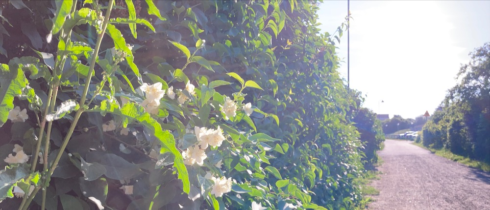

    

# Mikaela Källberg, Junior Software Developer

    

# About Me

 Welcome!

 My name is Mikaela, I'm in the beginning of learning coding/programming/software development, as we say in Sweden "A beloved child has many names". I got my start by taking a 5 day coding challenge with Code Institute <a>https://codeinstitute.net/</a>

I have now finished my last project with them, I chose Advanced Front End as my speciality. However I really enjoy backend work. From what I understand Code Institute is a little bit different from other schools, where students projects has to be their own and has to have something unique that shows they understand what they've done.

My future goal is to study Bioinformatics and help further the medical scientific field, hopefully with genetic conditions. As a step in that direction I am now pursuing my Bachelor in Biomedicine. In the mean time I work to develop this craft and hope to find people to work with.

I hope you'll have a beautiful day!

# My Tech Stack 

### **Frontend**

&nbsp;
&nbsp;
&nbsp;
&nbsp;
&nbsp;
&nbsp;

#
### **Backend**

&nbsp;
&nbsp;
&nbsp;
&nbsp;

#
### **Database**

&nbsp;
&nbsp;

#
### **Version Control**

&nbsp;
&nbsp;

#
### **Development and Deployment**

&nbsp;
&nbsp;
&nbsp;

#
### **Learning in progress**

&nbsp;
&nbsp;

#
## GitHub Statistics

    
    

# Channel lead

 Code Institute has a strong community on the messaging app Slack, where we all students, alumnis and CI-staff help each other in different ways and just hang out and support each other. If you are active in that community and help your fellow students, Code Institute offers you to be lead for a channel during a two month period. During July, November and December I am lead for the Portfolio Project 3 channel, where students create a unique project using the Python.
 

# Hackathon Projects

[Code Institute](https://codeinstitute.net/) have monthly hackathon projects where people can work together in small groups of fellow developers to produce a themed project in 5 days. I look forward to add my own experience here one day.

#
## If you wish to contact me

